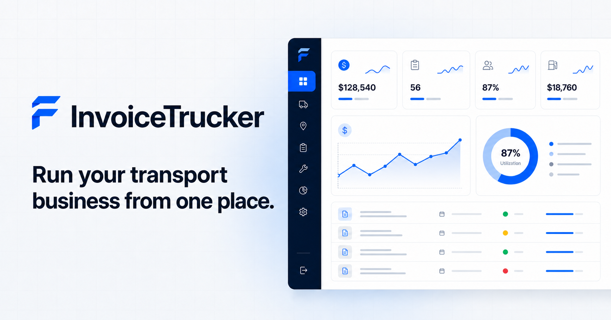
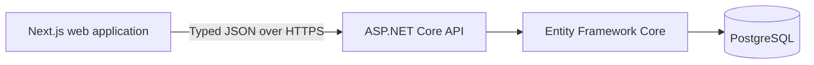

# InvoiceTrucker

[](https://github.com/ylberxhambazi/InvoiceTrucker/actions/workflows/ci.yml)
[](LICENSE)
[](https://nextjs.org/)
[](https://dotnet.microsoft.com/apps/aspnet)
[](https://www.postgresql.org/)

Modern truck invoicing and fleet management platform built with Next.js, React, ASP.NET Core and PostgreSQL.

InvoiceTrucker is a fictional, open-source portfolio showcase with a public
landing page, a polished read-only SaaS demo, an ASP.NET Core API, and
deterministic PostgreSQL data.

> All companies, people, vehicles, documents, and financial records shown in
> InvoiceTrucker are fictional. This project is not intended to store real
> commercial information or operate as production business software.



## Overview

InvoiceTrucker demonstrates:

- a responsive Next.js App Router frontend with typed API integration;
- data tables, mobile alternatives, filtering, search, sorting, and pagination;
- dashboard and reporting charts, invoice detail, and print preview;
- an ASP.NET Core minimal API with request and response DTOs;
- EF Core modeling, indexes, constraints, migrations, and deterministic seeds;
- PostgreSQL, health checks, structured logging, Problem Details, CORS, and
  rate limiting;
- frontend, API integration, and end-to-end test suites;
- Docker Compose and GitHub Actions release infrastructure.

The public demo intentionally excludes authentication, editing workflows,
payments, OCR/AI scanning, subscriptions, and multi-tenancy.

## Architecture



The browser never connects directly to PostgreSQL. The API projects EF entities
into response DTOs, and `packages/types` defines matching frontend transport
contracts. Read [the architecture guide](docs/architecture.md) for request
flow, boundaries, and deployment topology.

## Technology

- Next.js 16, React 19, TypeScript, Tailwind CSS
- TanStack Query, React Hook Form, Recharts
- ASP.NET Core 10, Entity Framework Core, FluentValidation
- PostgreSQL 18, Npgsql, Serilog
- Vitest, React Testing Library, xUnit, Playwright
- pnpm workspaces, Docker Compose, GitHub Actions

## Repository structure

```text
apps/
  web/                       Next.js application and browser tests
  api/
    FleetForge.Api/          ASP.NET Core API, EF model, and migrations
    FleetForge.Api.Tests/    API integration tests
packages/
  ui/                        Shared presentational components
  types/                     Frontend API transport contracts
  eslint-config/             Shared ESLint configuration
  typescript-config/         Shared strict TypeScript configuration
docs/                        API, architecture, deployment, and design docs
screenshots/                 Screenshot checklist and approved captures
.github/workflows/           Continuous integration
```

The backend assembly and folder names retain their historical `FleetForge`
identifier. They are internal implementation names kept to avoid breaking
.NET namespaces, project references, and the EF migration chain; all public
product branding is InvoiceTrucker.

## Demo routes

| Route             | Purpose                             |
| ----------------- | ----------------------------------- |
| `/`               | Public landing page and newsletter  |
| `/demo`           | Fleet and financial dashboard       |
| `/demo/trucks`    | Searchable, filterable truck list   |
| `/demo/drivers`   | Driver list and status filters      |
| `/demo/clients`   | Client list and search              |
| `/demo/invoices`  | Invoice list and status filters     |
| `/demo/expenses`  | Expense ledger                      |
| `/demo/reports`   | Twelve-month reporting overview     |
| `/demo/documents` | Document register                   |
| `/demo/settings`  | Read-only fictional company profile |

Truck, driver, client, and invoice list routes also link to their respective
detail views.

## Local development

Prerequisites:

- Node.js 22+
- pnpm 10.16.1
- .NET SDK 10
- PostgreSQL 18, installed locally or provided through Docker

```bash
cp .env.example .env
pnpm install --frozen-lockfile
docker compose up -d postgres
dotnet tool restore
dotnet tool run dotnet-ef database update \
  --project apps/api/FleetForge.Api \
  --startup-project apps/api/FleetForge.Api
pnpm dev
```

The frontend runs at `http://localhost:3000`; the API runs at
`http://localhost:5050`.

## Environment variables

| Variable                        | Purpose                                                              | Local example           |
| ------------------------------- | -------------------------------------------------------------------- | ----------------------- |
| `NEXT_PUBLIC_API_URL`           | Browser-visible API base URL                                         | `http://localhost:5050` |
| `NEXT_PUBLIC_SITE_URL`          | Canonical InvoiceTrucker frontend URL                                | `http://localhost:3000` |
| `NEXT_PUBLIC_PRODUCT_URL`       | Optional link to the separate production product                     | empty                   |
| `ConnectionStrings__FleetForge` | PostgreSQL connection string; key retained for backend compatibility | see `.env.example`      |
| `Cors__AllowedOrigins__0`       | Allowed frontend origin                                              | `http://localhost:3000` |
| `Database__ApplyMigrations`     | Compose-only startup migration switch                                | `false`                 |
| `EmailNotifications__ResendApiKey` | Server-only Resend key for early-access notifications             | empty                   |
| `EmailNotifications__RecipientAddress` | Destination for early-access notifications                    | `info@invoicetrucker.com` |
| `POSTGRES_DB`                   | Compose database name                                                | `invoicetrucker`        |
| `POSTGRES_USER`                 | Compose database user                                                | `invoicetrucker`        |
| `POSTGRES_PASSWORD`             | Fictional local-only Compose password                                | `invoicetrucker_dev`    |

`NEXT_PUBLIC_*` values are embedded in the browser bundle and must never
contain secrets. Real `.env` files are ignored; root, frontend, and API example
files contain local-only fictional values.

## Database and migrations

Start only PostgreSQL:

```bash
docker compose up -d postgres
```

Create a migration after an intentional EF model change:

```bash
dotnet tool run dotnet-ef migrations add MigrationName \
  --project apps/api/FleetForge.Api \
  --startup-project apps/api/FleetForge.Api
```

Apply pending migrations:

```bash
dotnet tool run dotnet-ef database update \
  --project apps/api/FleetForge.Api \
  --startup-project apps/api/FleetForge.Api
```

Managed deployments should run migrations as a separate release step. Compose
enables migration-on-start for convenient single-instance local use.

## Deterministic fictional data

Migrations seed approximately 15 trucks, 12 drivers, 20 clients, 50 invoices,
100 invoice items, 80 expenses, 25 documents, 30 activity records, one company
profile, and twelve months of financial reporting data. Reserved example
domains and visibly fictional identifiers are used throughout.

## Commands

Frontend:

```bash
pnpm lint
pnpm typecheck
pnpm test:web
pnpm build:web
pnpm test:e2e
```

Backend:

```bash
dotnet restore apps/api/FleetForge.slnx
dotnet build apps/api/FleetForge.slnx --no-restore
dotnet test apps/api/FleetForge.slnx --no-build
dotnet format apps/api/FleetForge.slnx --no-restore --verify-no-changes
```

Whole repository:

```bash
pnpm test
pnpm build
pnpm format:check
```

## API documentation

Read [the API reference](docs/api.md) for endpoints, query parameters, response
shapes, Problem Details, newsletter behavior, CORS, and environment behavior.
Development OpenAPI JSON is exposed at `/openapi/v1.json`.

## Docker

```bash
# Database only
docker compose up -d postgres

# Full stack
docker compose up --build
```

Compose waits for PostgreSQL health, applies migrations in the API container,
then waits for API health before starting the frontend.

## Screenshots

The repository preview above is the approved Open Graph image. The
[screenshot guide](screenshots/README.md) lists required desktop and mobile
captures, naming conventions, fictional-data review, and redaction checks.
Deployment-specific screenshots should be added only after the public URL is
verified.

## Accessibility

InvoiceTrucker includes skip links, landmarks, visible focus states, labeled
forms, keyboard-operable navigation, responsive table alternatives,
screen-reader status announcements, reduced-motion handling, and print styles.
Automated checks complement manual keyboard and screen-reader review.

## Security

- Demo endpoints are public and read-only except newsletter registration.
- Newsletter registration is validated, normalized, uniquely constrained, and
  rate limited.
- CORS must explicitly list every deployed frontend origin.
- Logs do not include newsletter email addresses.
- Local example passwords are fictional and must be replaced when hosted.
- See [SECURITY.md](SECURITY.md) for responsible disclosure.

## Related product experience

The developer has separately built a full truck-focused invoicing platform
with authentication, invoice workflows, client and fleet management, OCR/AI
invoice scanning, exports, and subscription management.

That production product and its source code are not part of this repository.
No customer information, credentials, proprietary branding, production
configuration, or private source code was copied into InvoiceTrucker. The
optional external link is configured only through `NEXT_PUBLIC_PRODUCT_URL`.

## Deployment

The frontend can run on Vercel or a Docker-compatible platform. The API can run
on any .NET-capable container platform, with PostgreSQL supplied by a managed
provider. See [the deployment guide](docs/deployment.md).

## Known limitations

- Portfolio showcase, not production business software
- No authentication, authorization, tenancy, or user accounts
- No create, edit, or delete operations beyond newsletter registration
- No file download or document storage
- Invoice print preview uses the browser print dialog
- Demo views require the API and PostgreSQL; there is no mock-data fallback
- Newsletter entries stay in PostgreSQL; notification delivery requires a
  Resend API key and a verified sender domain

## Roadmap

Version 1.0 completes the planned public showcase. Future work is limited to
maintenance: dependency upgrades, accessibility findings, deployment URLs,
verified screenshots, and documentation corrections. New product features are
intentionally out of scope.

## GitHub topics

Suggested topics: `nextjs`, `react`, `typescript`, `dotnet`, `aspnet-core`,
`postgresql`, `docker`, `fleet-management`, `invoice`, `transport`, `saas`,
`tailwindcss`.

## Contributing

Read [CONTRIBUTING.md](CONTRIBUTING.md) before opening an issue or pull request.
Never include real business data in fixtures, screenshots, issues, or code.

## Licence

InvoiceTrucker is available under the [MIT License](LICENSE).
