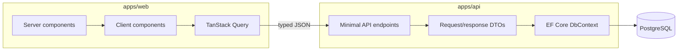

# InvoiceTrucker architecture

InvoiceTrucker is a pnpm workspace for the Next.js application and shared
TypeScript packages, alongside a native .NET solution for the API and tests.

## Repository boundaries

- `apps/web`: Next.js App Router UI, API client, unit tests, and Playwright
  tests.
- `apps/api/FleetForge.Api`: endpoints, validation, domain entities, EF
  configuration, migrations, health checks, and logging.
- `apps/api/FleetForge.Api.Tests`: HTTP-level API integration tests.
- `packages/ui`: small presentational primitives.
- `packages/types`: browser-side transport contracts.
- `packages/eslint-config` and `packages/typescript-config`: shared tooling.

## Frontend

Landing-page content is rendered by server components. Interactive navigation,
newsletter submission, demo queries, filters, charts, and print controls are
client components.

`lib/api-client.ts` owns the API base URL, JSON headers, response parsing, and
typed `ApiError`. It exposes focused GET and POST helpers without hiding
resource-specific behavior behind a generic repository.

TanStack Query manages cancellation signals, caching, retry, and loading/error
state for the demo. Queries use stable resource-specific keys. There is no
frontend demo-data fallback.

List state lives in URL search parameters. Search submissions, filters, sort,
and pagination can therefore be linked, refreshed, and navigated with browser
history. Desktop tables switch to labeled record cards on smaller screens.

## Backend

Endpoint modules are grouped by domain under `Endpoints/`. They validate
allow-listed sorting and domain filters, build EF queries, apply stable
ordering, and project directly to DTOs.

EF entities remain internal to persistence. Relationships and constraints are
defined through `IEntityTypeConfiguration` classes:

- optional one-to-one truck/driver assignment;
- client and truck invoice relationships;
- invoice line items;
- truck expenses;
- documents owned by exactly one truck, driver, or client;
- standalone newsletter and activity records;
- one fictional company profile for read-only settings.

PostgreSQL is the only runtime data source. Migrations own schema evolution and
deterministic fictional seed data. No lazy-loading package is enabled.

## Validation and errors

FluentValidation handles newsletter bodies. Query helper validation handles
page limits, sorting, date ranges, and filters. PostgreSQL constraints enforce
uniqueness and data invariants after application validation.

Expected failures use RFC 7807 Problem Details. A focused exception handler
converts malformed minimal-API binding into safe responses. The API does not
use catch-all handling that conceals unexpected failures.

## Operations

Serilog produces structured console logs and request logs. Health checks include
the EF Core PostgreSQL connection. CORS accepts explicit configured origins.
Newsletter registration has a per-IP fixed-window rate limit.

Compose may apply migrations during single-instance local startup. Hosted
environments should run migrations as a release step before scaling the API.

## Testing

- Frontend unit tests verify rendered content, navigation, conditional CTAs,
  form validation, API outcomes, and duplicate-submit protection.
- API integration tests use `WebApplicationFactory` and EF's in-memory provider
  to exercise HTTP contracts.
- Playwright starts the real API and frontend against PostgreSQL for critical
  end-to-end paths.
- GitHub Actions runs these layers separately so failures identify the affected
  boundary.

## Read-only portfolio design

The demo intentionally exposes no authentication, accounts, editing, uploads,
or simulated save behavior. Newsletter registration is the sole public write.
This keeps the repository reviewable and prevents it from implying production
capabilities it does not provide.

## Separation from the production product

The developer's production product is separate. InvoiceTrucker shares no source
code, customer data, employer code, branding, credentials, or production
configuration. The landing page describes related experience in general terms
and renders an external CTA only when `NEXT_PUBLIC_PRODUCT_URL` is configured.
